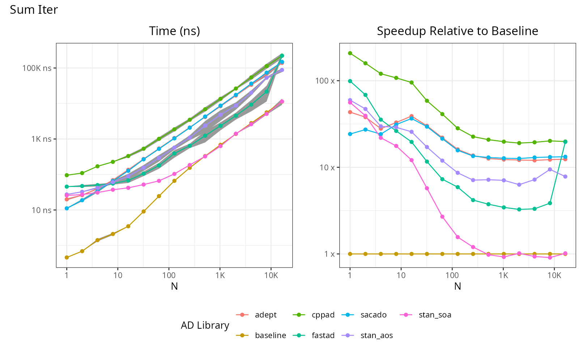
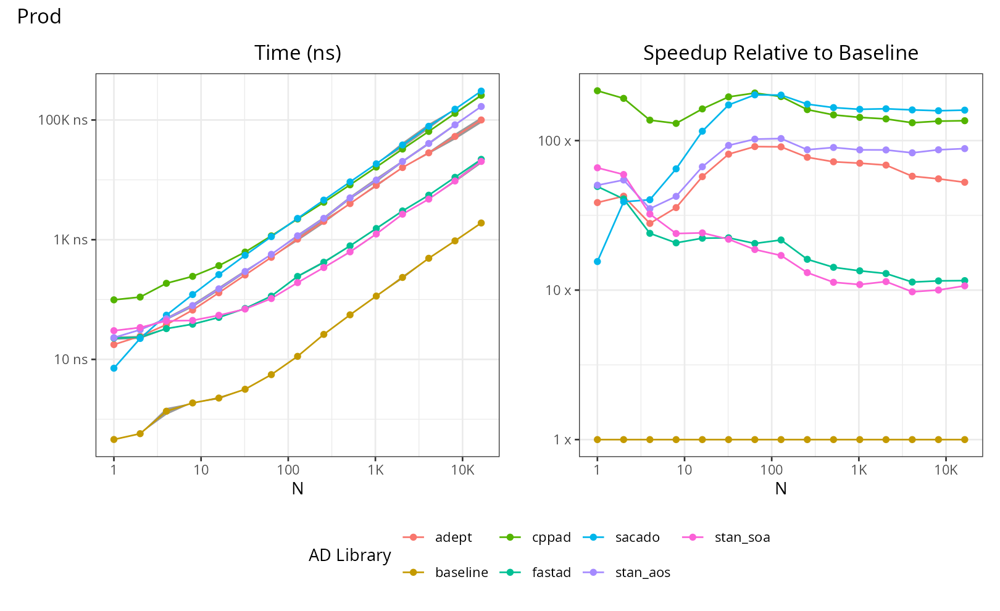
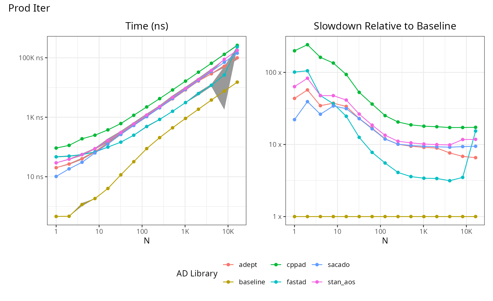
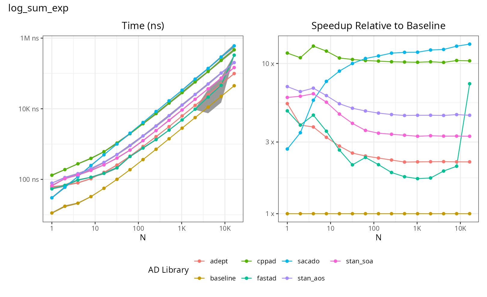
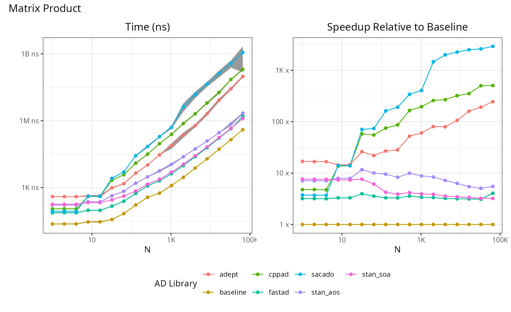
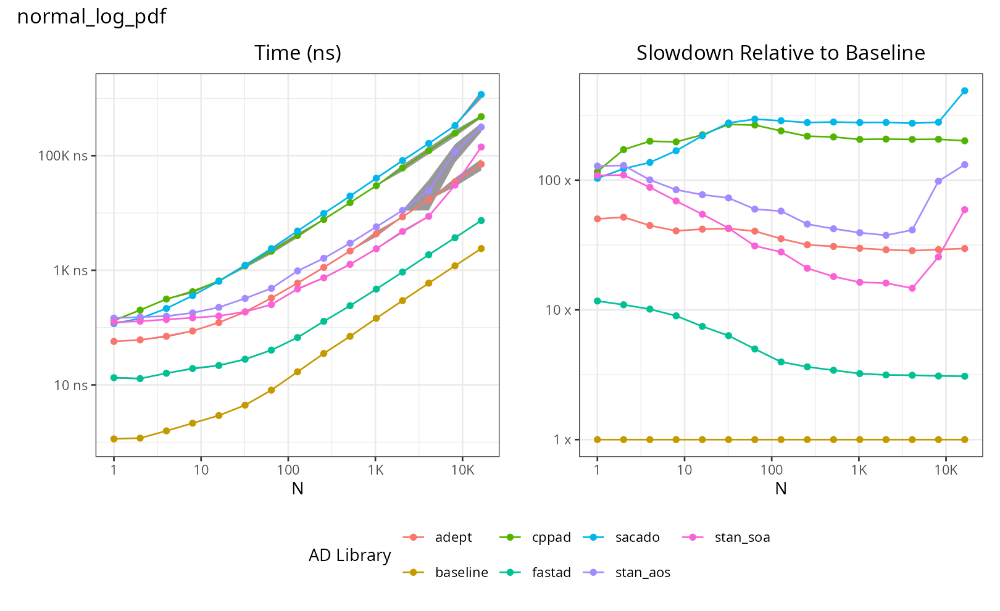
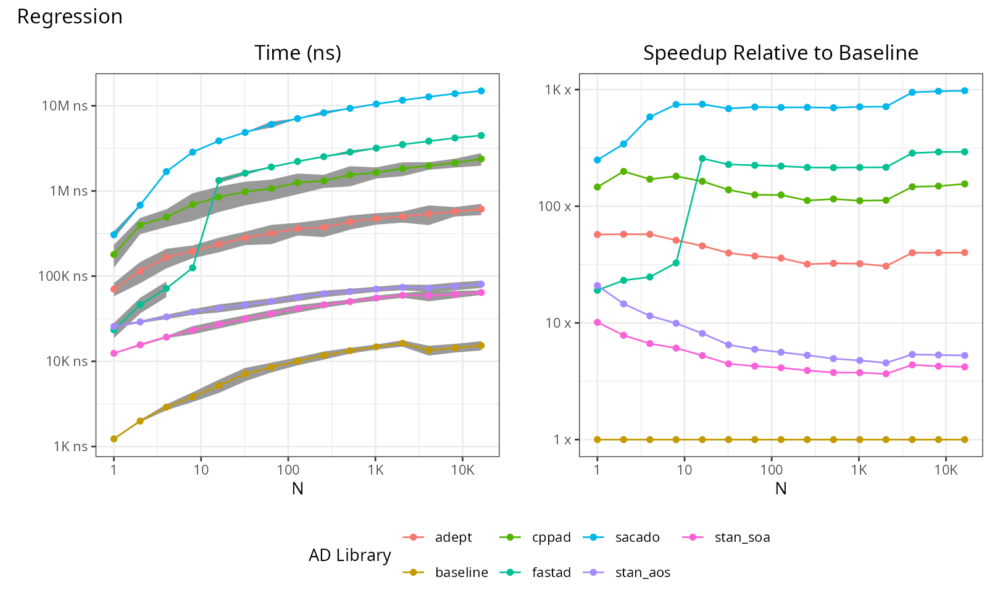
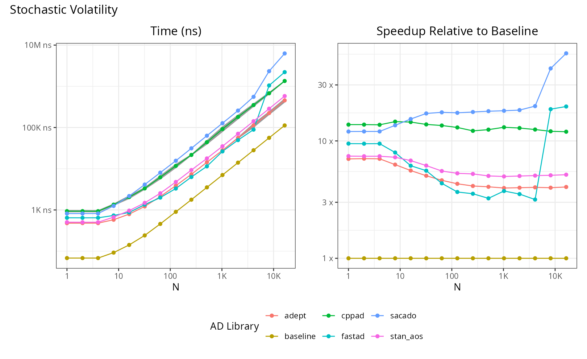

# AD Benchmark

This is a repository dedicated to benchmarking automatic differentiation libraries for research purposes.
This benchmark has only been tested on MacOS Catalina.

## Installation

First clone the repository:
```
git clone https://github.com/JamesYang007/ADBenchmark.git
```

Then run cmake to install all dependencies (and their dependencies):
- [Adept](http://www.met.reading.ac.uk/clouds/adept/)
- [ADOL-C](https://github.com/coin-or/ADOL-C)
- [CppAD](https://coin-or.github.io/CppAD/doc/cppad.htm)
- [Sacado](https://github.com/trilinos/Trilinos/tree/master/packages/sacado)
- [FastAD](https://github.com/JamesYang007/FastAD)
- [STAN math](https://github.com/stan-dev/math)

```
# CMAKE_POLICY_VERSION_MINIMUM=3.5 is for tbb that Stan relies on
cmake -S . -B "build" --fresh -DCMAKE_POLICY_VERSION_MINIMUM=3.5 --fresh
# Compile all benchmarks
cmake --build build --target all_benches -j24
# Run script for benchmarks
python3 -m venv .venv
source ./.venv/bin/activate
pip3 install matplotlib pandas
cd ./analyze
python ./analyze.py
cd ..
# Make plots
RScript ./plots.R
```

We wrote a Python script in `analyze` called `analyze.py` that
scrapes `build/benchmark` directory for all tests in each library directory,
runs the benchmark programs,
and saves the absolute times (in nanoseconds) and
the plots of relative time against FastAD for each test in `docs/data` and `docs/figs`, respectively.
To run the script:
```
cd analyze
python3 analyze.py
```
__It is important to be inside `analyze` directory__.

## Benchmark Results

### Sum


### Sum (Iterative)


### Product


### Product (Iterative)


### Log-Sum-Exponential


### Matrix Product and Sum Elements


### Normal-Log-PDF


### Regression Model


### Stochastic Volatility Model


## NOTES

On linux, it is recommended that you set your CPU governor to performance

```bash
sudo cpupower frequency-set --governor performance
```